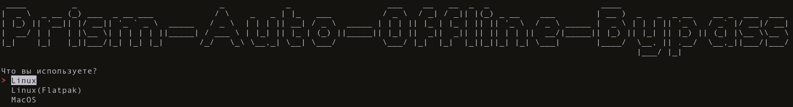

# Об этом проекте
Обход проверки наличия у пользователя реальной учетной записи Microsoft.
*Он предназначен исключительно для ознакомительных целей.*

 
# Перед установкой
Если у вас есть какие-либо сохраненные учетные записи, выполнение этого скрипта приведет к их удалению!

```bash

cd PrismLauncher-Auto-Offline-Bypass/
python -m venv venv
pip install -r requirements.txt
python main-script.py
```

# Как использовать 

* Установите Prism Launcher
* Пройдите быструю настройку
* Закрыть меню запуска
* Выполните скрипт выбрав нужные параметры
* Создать офлайн-аккаунт
* Установите созданную учетную запись в качестве учетной записи по умолчанию.
* Наслаждаться!

# Чего не следует делать 
Не удаляйте аккаунт "Без профиля", это нарушит работу обхода!

# Пользовательские скины
Вы можете использовать систему скинов Ely.by на [ElyPrismLauncher](https://github.com/Octol1ttle/ElyPrismLauncher)

# Какие системы потдерживаються?
* Linux
* MacOS (не проверял)
